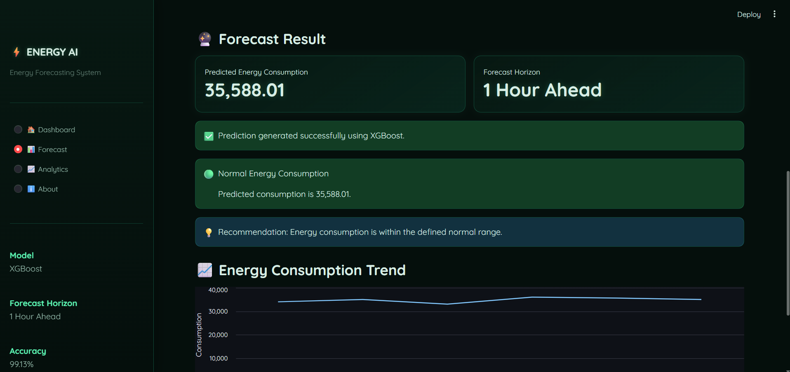
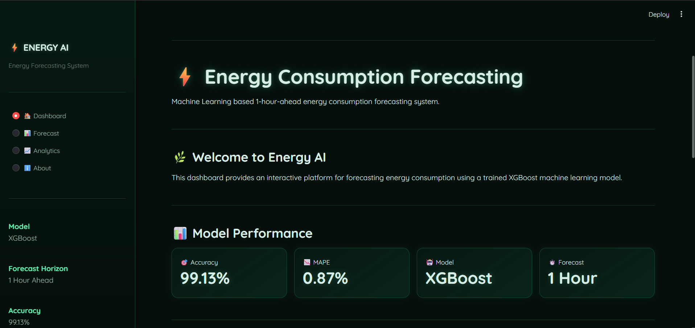
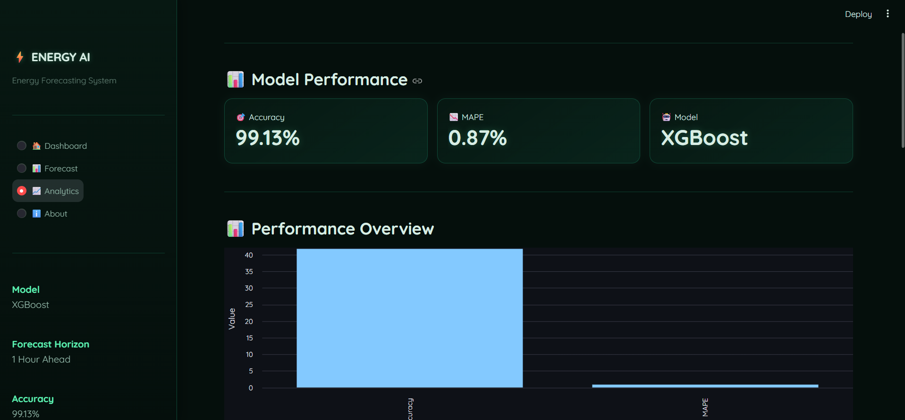

# ⚡ Energy Consumption Forecasting

A Machine Learning based web application that predicts **energy consumption 1 hour ahead** using historical energy consumption data and time-based features.

## 🚀 Project Overview

This project uses an **XGBoost Regression model** to forecast future energy consumption.

The model is integrated with a **Streamlit web application**, providing an interactive dashboard where users can enter historical consumption values and generate predictions.

## ✨ Features

- ⚡ 1-hour-ahead energy consumption forecasting
- 🤖 XGBoost Machine Learning model
- 📊 Interactive Streamlit dashboard
- 📈 Energy consumption trend visualization
- 📋 Prediction history
- 📥 Download prediction history as CSV
- 🌱 Eco-themed user interface

## 🧠 Machine Learning Model

**Algorithm:** XGBoost Regressor

### Input Features

- Hour
- Day of Week
- Month
- Previous Hour Consumption
- 2 Hours Ago Consumption
- 3 Hours Ago Consumption
- 24 Hours Ago Consumption
- 7 Days Ago Consumption

### Model Performance

- Accuracy: **99.13%**
- MAPE: **0.87%**
- Forecast Horizon: **1 Hour Ahead**

## 🛠️ Technologies Used

- Python
- Pandas
- XGBoost
- Streamlit
- NumPy
- Scikit-learn

## 📂 Project Structure

```text
Energy_Forecasting_Project/
│
├── app.py
├── app_backup.py
├── requirements.txt
├── xgb_model.json
├── xgb_model.pkl
├── .gitignore
└── README.md
```

## 🖥️ Application Screenshots

### 🏠 Dashboard
<p align="center">
  
</p>

### 📊 Forecast Result
<p align="center">
  
</p>

### 📈 Analytics
<p align="center">
  
</p>

